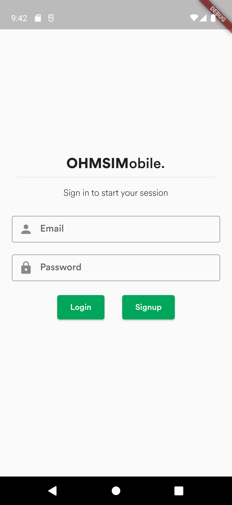
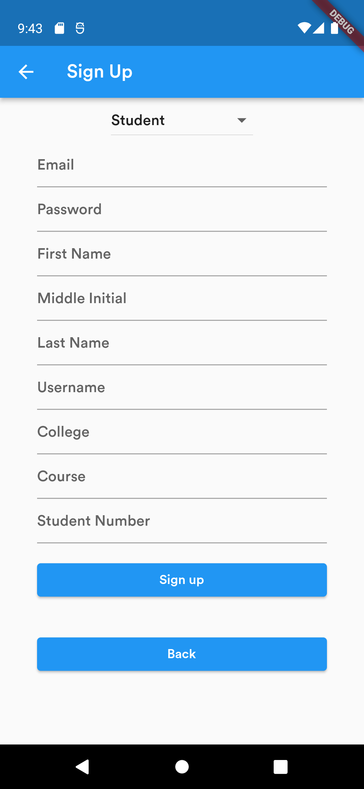
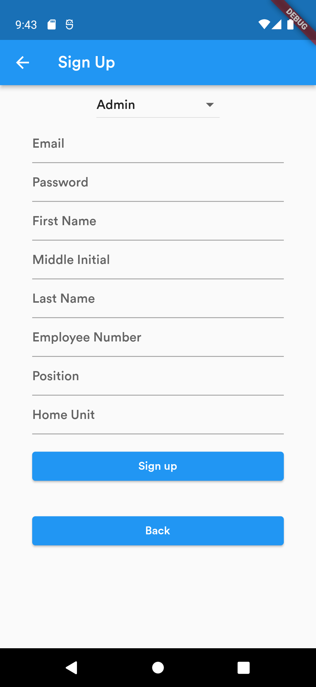
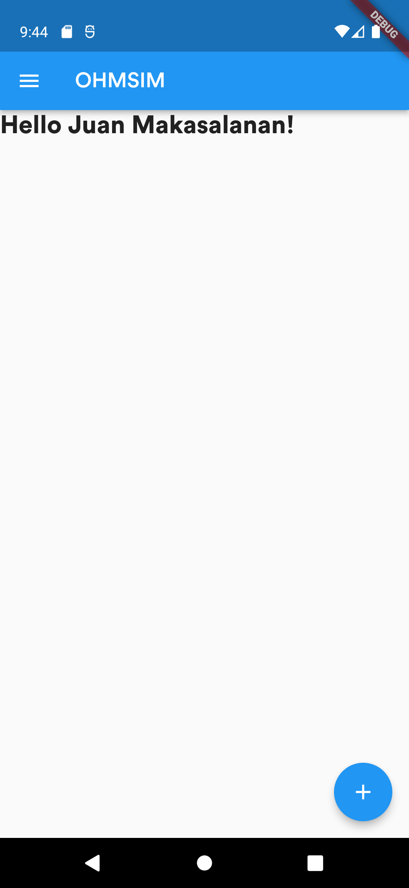
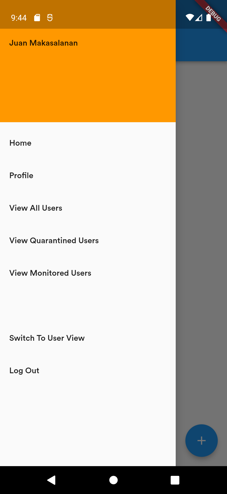

<h1 align="center"> OHMSIM </h1>

Online Health Monitoring System In Mobile (OHMSIM) is an application that serves as a contact tracing tool for potential COVID-19 cases in the community. This aims to track any individuals who possibly has COVID-19 through symptoms and/or being exposed/contact to someone who is confirmed to have COVID-19. 

# Table of Contents
1. [Road Map](#road-map)
    - [Milestone 1](#milestone-1)
2. [Authors](#authors)

## Road Map  
- [x] Screens without functionality (3 screens minimum)
- [ ] Authentication
- [ ] Firebase CRUD

### Milestone 1  

The features created for this milestone are:

- Created 3 different screens

    - a. Log In Screen
        
        
 
             
        

        
<i>Figure 1. Log In screen for all user types.</i>

    - b. Sign Up Screen

        

            
        

        
<i>Figure 2a. Sign Up screen for all student users.</i>

        

            
        

        
<i>Figure 2b. Sign Up screen for all admin and entrance monitor users.</i>

    - c. Homepage for Admin View

        

            
        

        
<i>Figure 3a. Homepage of admin users.</i>

        

            
        

        
<i>Figure 3b. Drawer for the homepage of admin users with tabs of their features.</i>

    

## Authors:  
* Jose Benjamin Gallero
* Junel Alje Isanan
* Luke Adrian Pineda
* Jerico Luis A. Ungos

