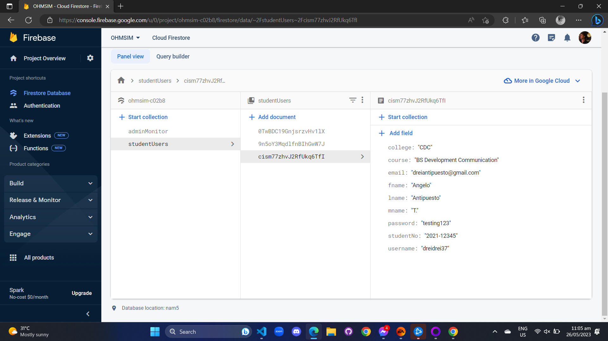
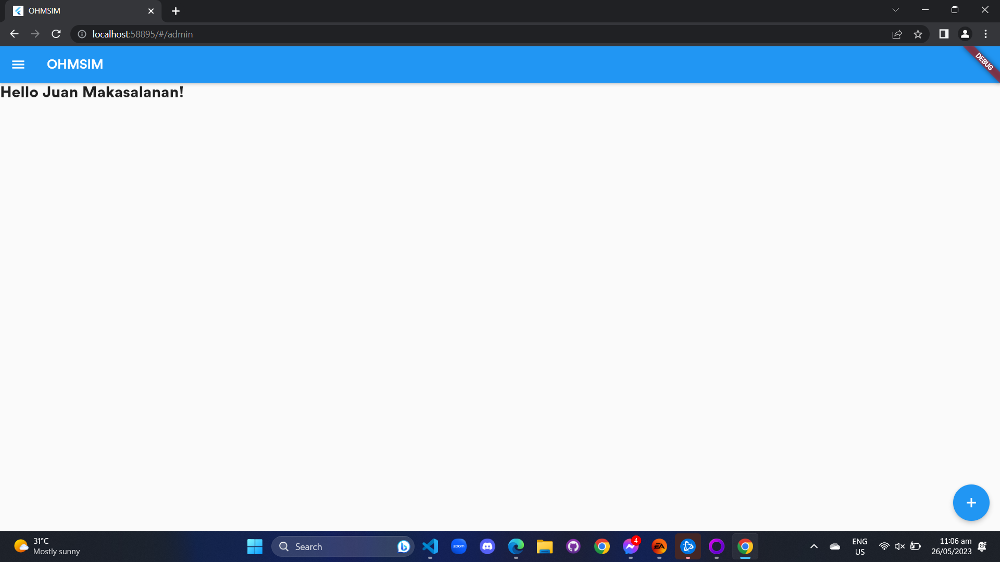
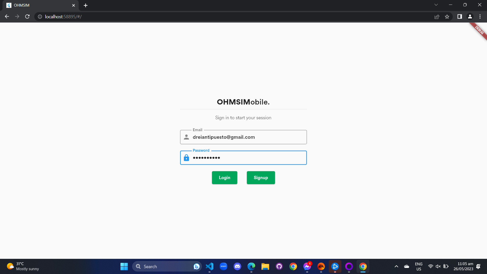

# OHMSIM

Online Health Monitoring System In Mobile (OHMSIM) is an application that serves as a contact tracing tool for potential COVID-19 cases in the community. This aims to track any individuals who possibly have COVID-19 through symptoms and/or being exposed/contact to someone who is confirmed to have COVID-19.

## Table of Contents

1. [Road Map](#road-map)
   - [Milestone 1](#milestone-1)
   - [Milestone 2](#milestone-2)
2. [Authors](#authors)

## Road Map 

- [x] Screens without functionality (3 screens minimum)
- [x] Authentication
- [ ] Firebase CRUD

## Milestone 1 

The features created for this milestone are:

### Screens

1. **Log In Screen**  
     
   _Figure 1: Log In screen for all user types._

2. **Sign Up Screen (Student)**  
     
   _Figure 2a: Sign Up screen for all student users._

3. **Sign Up Screen (Admin)**  
     
   _Figure 2b: Sign Up screen for all admin and entrance monitor users._

4. **Homepage for Admin View**  
     
   _Figure 3a: Homepage of admin users._

5. **Homepage Drawer for Admin View**  
     
   _Figure 3b: Drawer for the homepage of admin users with tabs of their features._

## Milestone 2 

The focus of Milestone 2 is to implement authentication and database functionality in Flutter, as well as create a landing page, login screen, and signup screens for both admin and student users.

### Tasks for Milestone 2

- [x] Implement authentication state management in Flutter.
- [x] Set up a database for storing user information.
- [x] Create a landing page.
- [x] Design and implement a login screen.
- [x] Design and implement signup screens for admin and student users.

### Screenshots

1. **Database Setup for Storing User Information**  
     
   _Figure 4: Screenshot of the database setup for storing user information._

2. **Landing Page Design**  
     
   _Figure 5: Screenshot of the landing page design._

3. **Login Screen Design**  
     
   _Figure 6: Screenshot of the login screen design._

4. **Signup Screen for Admin Users**  
     
   _Figure 7: Screenshot of the signup screen design for admin users._

5. **Signup Screen for Student Users**  
     
   _Figure 8: Screenshot of the signup screen design for student users._

## Authors 

- Jose Benjamin Gallero
- Junel Alje Isanan
- Luke Adrian Pineda
- Jerico Luis A. Ungos
