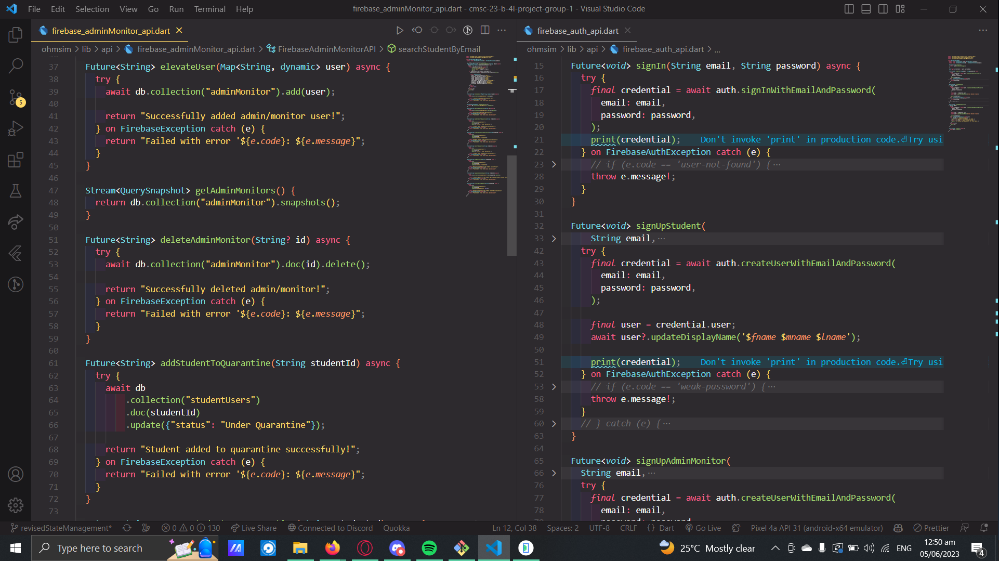
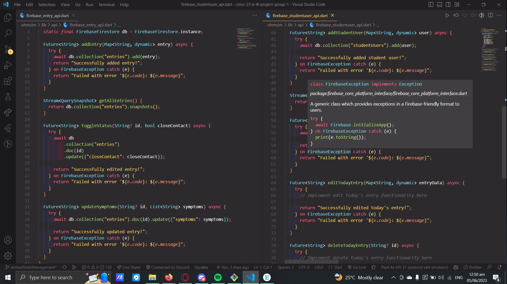
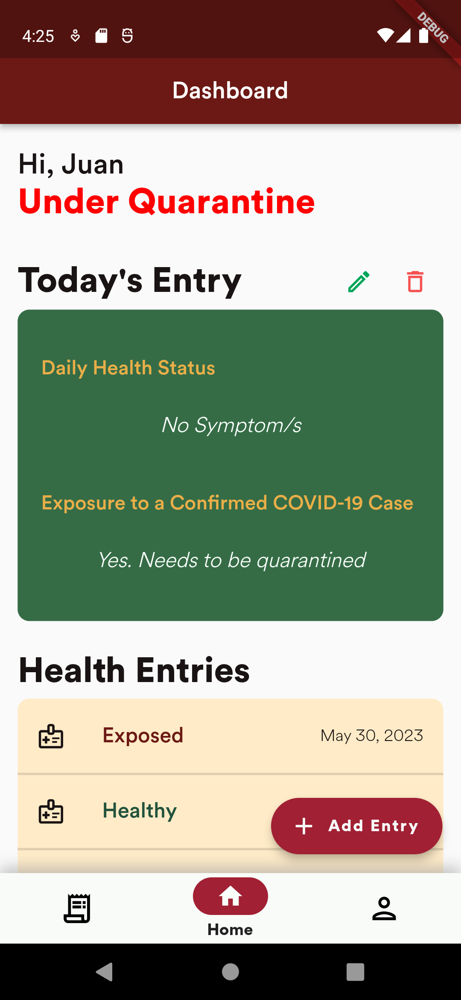
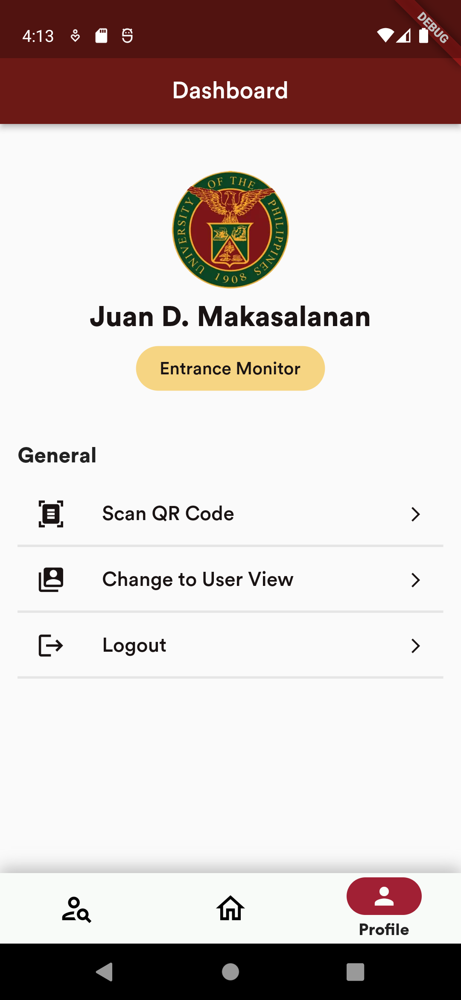
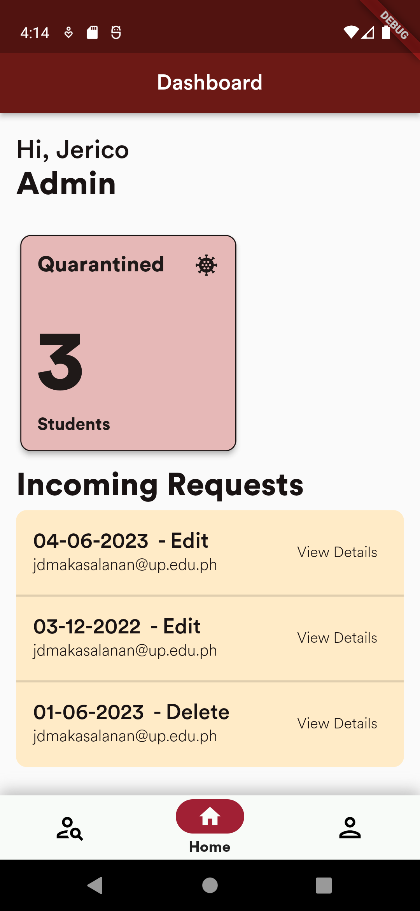
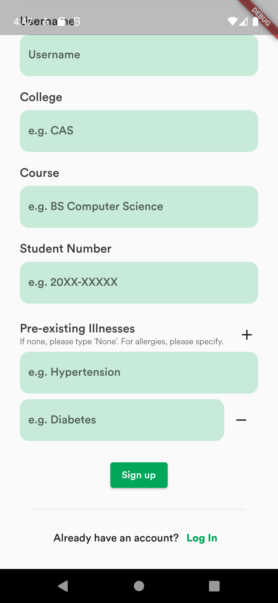

<h1 align="center"> OHMSIM </h1>

Online Health Monitoring System In Mobile (OHMSIM) is an application that serves as a contact tracing tool for potential COVID-19 cases in the community. This aims to track any individuals who possibly has COVID-19 through symptoms and/or being exposed/contact to someone who is confirmed to have COVID-19. 

## Table of Contents

1. [Road Map](#road-map)
   - [Milestone 1](#milestone-1)
   - [Milestone 2](#milestone-2)
   - [Milestone 3](#milestone-3)
2. [Authors](#authors)

## Road Map 

- [x] Screens without functionality (3 screens minimum)
- [x] Authentication
- [x] Firebase CRUD

## Milestone 1 

We focused on generating at least 3 screens for this milestone.

### Tasks for Milestone 1

- [x] Designed and created the Login Screen
- [x] Designed and created the Signup Screen
- [x] Created the Homepage Screen for the Admin View

### Screenshots
1. **Log In Screen**

   
 
       
   

   
<i>Figure 1. Log In screen for all user types.</i>

2. **Sign Up Screen**

   

      
   

   
<i>Figure 2a. Sign Up screen for all student users.</i>

   

      
   

   
<i>Figure 2b. Sign Up screen for all admin and entrance monitor users.</i>

3. **Homepage for Admin View**

   

      
   

   
<i>Figure 3a. Homepage of admin users.</i>

   

      
   

   
<i>Figure 3b. Drawer for the homepage of admin users with tabs of their features.</i>

## Milestone 2 

The focus of Milestone 2 is to implement authentication and database functionality in Flutter, as well as create a landing page, login screen, and signup screens for both admin and student users.

### Tasks for Milestone 2

- [x] Implement authentication state management in Flutter.
- [x] Set up a database for storing user information.
- [x] Create a landing page.
- [x] Design and implement a login screen.
- [x] Design and implement signup screens for admin and student users.

### Screenshots

1. **Database Setup for Storing User Information**  
   

      
   

   
<i>Figure 4: Screenshot of the database setup for storing user information.</i>

2. **Landing Page Design**  
   

      
   

   
<i>Figure 5: Screenshot of the landing page design.</i>

3. **Login Screen Design**
   

      
   

   
<i>Figure 6: Screenshot of the login screen design.</i>

4. **Signup Screen for Admin Users**
   

      
   

   
<i>Figure 7: Screenshot of the signup screen design for admin users.</i>

5. **Signup Screen for Student Users**
   

      
   

   
<i>Figure 8: Screenshot of the signup screen design for student users.</i>

## Milestone 3 

This milestone focuses on implementing the CRUD (Create, Read, Update, Delete) operations using Firebase that would be used for the application.

### Tasks for Milestone 3

- [x] Devise Create Operations.
- [x] Devise Read Operations.
- [x] Devise Update Operations.
- [x] Devise Delete Operations.
- [x] Design and implement the dashboard screens for the different viewer types.
- [x] Added the dynamic form fields for the pre-existing illnesses in the

### Screenshots

1. **Designing and Formation of Firebase CRUD Operations**  
   

      
   

   
<i>Figure 9a: Firebase CRUD Operations.</i>

   

      
   

   
<i>Figure 9b: Firebase CRUD Operations.</i>

2. **Dashboard Screens for the Different User Types**  
   

      
   

   
<i>Figure 10a: One of the dashboard screens for Student Users.</i>

   

      
   

   
<i>Figure 10b: One of the dashboard screens for Admin Users.</i>

   

      
   

   
<i>Figure 10c: One of the dashboard screens for Entrance Monitor Users.</i>

3. **Implementation of Dynamic Form Fields in Sign Up Page**  
   

      
   

   
<i>Figure 11: Screenshot of the dynamic form field implementation.</i>

## Authors 

- Jose Benjamin Gallero
- Junel Alje Isanan
- Luke Adrian Pineda
- Jerico Luis A. Ungos
